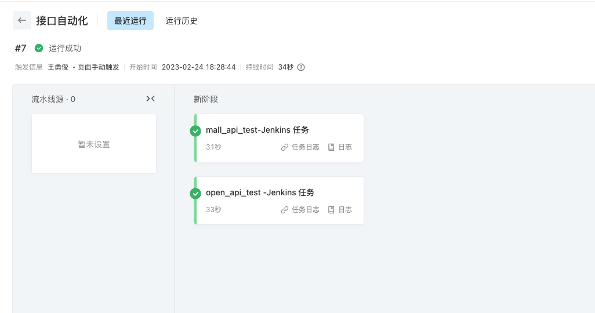

# API_AUTO_TEST

#### 介绍

运营商API自动化测试框架（python+pytest+allure）

#### 环境搭建

1. 安装python3.8+

> https://drive.weixin.qq.com/s?k=AKwA5AdKAA0Kmv2AK5

2. 安装依赖包

```shell
pip install -r requirements.txt --default-timeout=200 -i https://pypi.tuna.tsinghua.edu.cn/simple
```

> 有新增第三方库时，需要导出依赖包并上传
>```python
> pip freeze > requirements.txt
> ```

3. 使用[Pycharm](https://www.jetbrains.com/zh-cn/pycharm/download/)进行开发

#### 使用说明

1. cases层：存放各应用接口测试用例，conftest文件为初始化预处理逻辑；
2. service层：存放各应用接口链接及参数；
3. module层：存放各应用通用方法类；
4. untils层：存在全局通用工具类； 

常规编写逻辑：service层=》cases层conftest=》cases层test文件

#### 持续集成方案

1. 测试Jenkins地址 
> http://47.101.221.124:5673/view/%E8%87%AA%E5%8A%A8%E5%8C%96_API/
> 
> 流水线账号：flow/Wykj@@230316!

2. 流水线地址
> https://flow.aliyun.com/pipelines/2279109/current?page=1

3. 流水线配置流程 




5. 整体流程图
- Jenkins分定时构建、手动构建和发布构建触发构建三种机制；
- 定时构建：每天定时14点、18点触发，构建结果推送至测试小组群机器人，机器人key=e9a62b13-5c43-45ad-ba74-4619be336f12
- 手动构建：手动触发，消息推送同上
- 发布构建：应用发布完成后执行接口自动化流水线，触发Jenkins构建，消息推送应用发布群机器人，机器人key=4c9b2f5f-3a01-4c22-9b27-443ba7695b28